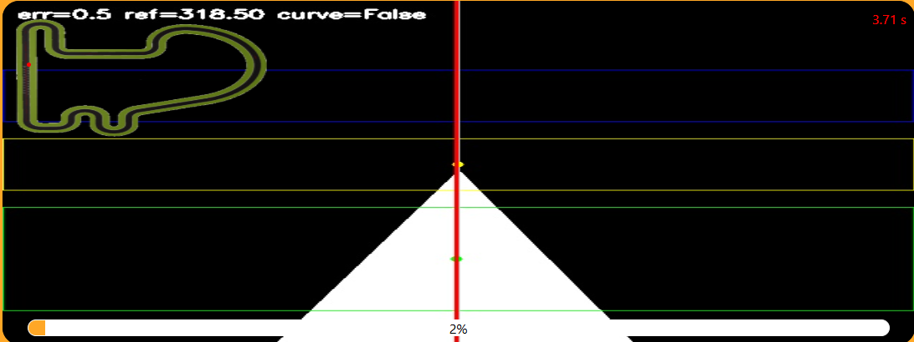
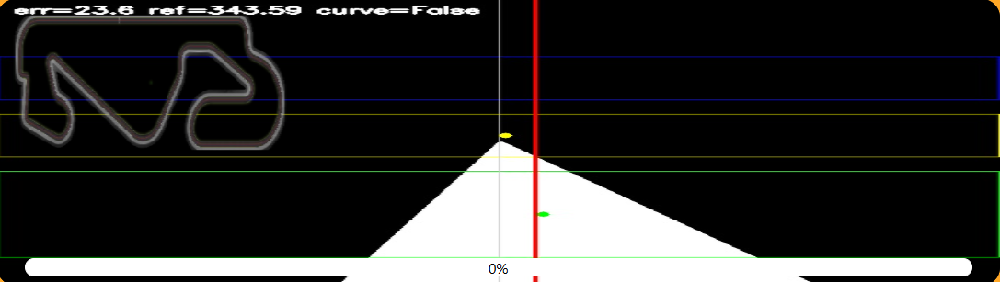

# Práctica 1 - Flow line

En esta práctica he desarrollado un **sistema de control PD** para permitir que un coche de F1 siga una línea roja en el suelo utilizando visión artificial.
La cámara del vehículo se encuentra ligeramente desplazada hacia la derecha, por lo que el sistema compesará ese desfase al calcular el error.
El objetivo principal es percibir la línea, estimar su trayectoria y ajustar la velocidad del vehículo en función del recorrido: aumentar la aceleración en tramos rectos y reducirla cuando se aproxima una curva para garantizar estabilidad y precisión.
Para abordar la solución de este problema, he dividido el sistema en los siguientes procesos:

- Segmentación de la línea
- Extracción de información espacial mediante ROIs
- Detección de curvas mediante desviación lateral
- Construcción de la referencia de trayectoria
- Ajuste de velocidad

## 1. Segmentación de la línea
El primer paso consiste en **detectar la línea roja en la imagen de la cámara**.

- Se convierte la imagen de **BGR a HSV**, ya que este espacio de color facilita la segmentación por color.
- Se utilizan **dos rangos de rojo** para cubrir la discontinuidad del tono rojo en HSV.
- Se aplica una **operación morfológica** para eliminar huecos y ruido.

Resultado: una **máscara binaria estable** que representa la línea.

# 2. Extracción de información espacial mediante ROIs

La imagen se divide en **tres regiones horizontales (ROIs)**:

- **Top ROI** → anticipa la trayectoria futura.
- **Mid ROI** → representa la trayectoria inmediata.
- **Bottom ROI** → representa la posición actual del robot respecto a la línea.

Cada ROI permite calcular el **centroide del mayor contorno detectado** mediante:

- `cv2.findContours`
- `cv2.moments`

Esto permite obtener tres puntos clave:

- cx_top 
- cx_mid
- cx_bot

A continuación, se muestra la imagen segmentada y dividida en las 3 regiones que se utilizarán más adelante para el seguimiento de la línea.

A pesar que se ha divido la imagen en 3 partes, según se iba mejorando el sistema, la sección de top no se usa porque el coche de F1 no percibe línea en esa franja. Esto es buena señal a la hora de hacer el seguimiento.

---

# 3. Detección de curvas mediante desviación lateral

Para determinar si el robot está en una **recta o una curva**, se calcula la desviación lateral entre puntos:

Se usa una variable global indicando el estado anterior, esto se hace para evitar cambios bruscos de estado:

- `CURVE_ON_TH` → umbral para entrar en modo curva
- `CURVE_OFF_TH` → umbral para volver a recta

---

# 4. Construcción de la referencia de trayectoria

La posición objetivo (`ref`) se calcula mediante una **media ponderada de los centroides**.

Las ponderaciones dependen de:

- si el robot está en **curva**
- si el robot está en **recta**
- qué ROIs están disponibles

### En rectas
Se prioriza el **punto más cercano (bottom)** para estabilidad.

### En curvas
Se da más peso a **mid y top** para anticipar la trayectoria.

Esto me permitió que el coche:

- se anticipe a las curvas
- reducir las oscilaciones
- mejorar estabilidad del coche

---

# 5. Control PD

Se utiliza un **controlador PD (Proporcional + Derivativo)**.

### Rectas
Control más agresivo para mantener estabilidad:

- Kp_straight
- Kd_straight

- MAX_SPEED
- MIN_SPEED

# Curvas
- Kp_curve
- Kd_curve

- MAX_SPEED_CURVE
- MIN_SPEED_CURVE

# Demo de la solución del problema 

## Circuito Simple

<video src="recursos/circuito_simple.mp4</video>

## Circuito Montmelo

