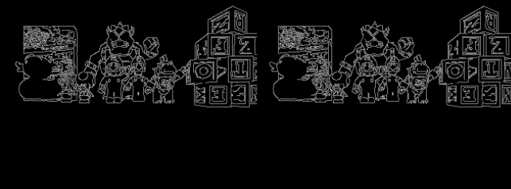
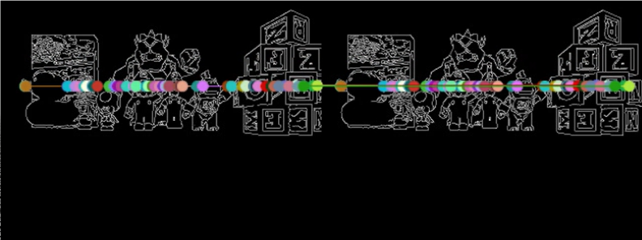
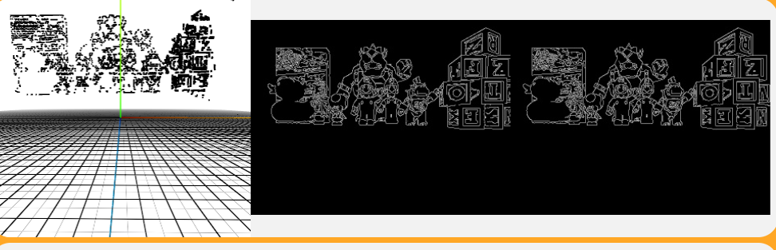

# Práctica 2 - Reconstrucción 3D con visión estéreo

En esta práctica he implementado un algoritmo de reconstrucción 3D a partir de un sistema de cámaras estéreo (izquierda y derecha).

Se basa en principios de **geometría epipolar**, **matching local** y **triangulación mediante rectas de retroproyección**.

## Objetivo

Reconstruir una nube de puntos 3D de la escena a partir de correspondencias entre ambas imágenes.

## Enfoque

Para abordar la solución de este problema, he dividido el sistema en las siguientes etapas:

- Selección de puntos de interés
- Cálculo del vector de proyección
- Construcción de la línea epipolar
- Búsqueda de correspondencia en la imagen derecha
- Triangulación (Reconstrucción 3D)

### Selección de puntos de interés

Se identifican puntos relevantes en la imagen izquierda mediante detección de bordes:

- Conversión a escala de grises
- Aplicación del detector de bordes de Canny
- Extracción de coordenadas de píxeles en blanco
- Reducción del número de puntos para optimizar el cálculo

### Cálculo del vector de proyección

Cada píxel seleccionado se convierte en una recta en el espacio 3D:

- Se transforma el píxel a coordenadas homogeneas
- Se calcula el vector dirección

### Construcción de la línea epipolar

A partir del vector de proyección de la cámara izquierda:

- Se generan dos puntos 3D sobre dicho vector
- Estos puntos se proyectan en la cámara derecha
- Se obtiene la línea epipolar en la imagen derecha

### Búsqueda de correspondencia en la imagen derecha

Se busca el punto homólogo en la imagen derecha:

- Se extrae una template centrada en el píxel de la izquierda
- Se define una región de interés (ROI) alrededor de la línea epipolar
- Se aplica `cv2.matchTemplate` dentro de esa ROI

### Triangulación (Reconstrucción 3D)

Una vez encontrada la correspondencia:

- Se utilizan rectas de retroproyección.
- Se obtienen dos rectas 3D (una por cada cámara)
- Se estima el punto 3D más corto entre ambas rectas

🔹 Nota: debido a ruido y errores, las rectas no se intersectan exactamente.

## Demo

