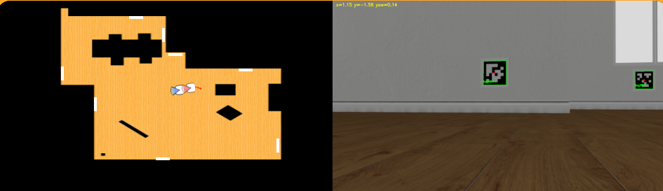
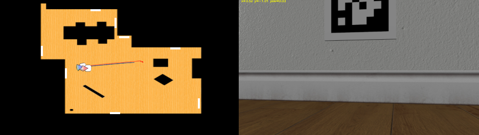

# Práctica 3 - Autolocalización visual basada en balizas

En esta práctica he implementado un algoritmo de autolocalización visual basada en balizas.

## Objetivo

El objetivo de esta práctica es localizar el robot (aspiradora) en el entorno mediante visión usando **AprilTags**. Una vez detectadas, el robot debe navegar de forma autónoma evitando colisiones utilizando los datos del sensor láser. En caso de no percibir ninguna baliza, se utiliza **odometría** para estimar la posición del robot.

## Enfoque

Para abordar la solución de este problema, he dividido el sistema en las siguientes etapas:

1. Detectar AprilTags
2. Estimar pose (visión o odometría)
3. Control de navegación

### 1. Detectar AprilTags

Se identifican las balizas presentes en la imagen capturada por la cámara del robot.

- **Adquisición de datos**: (image de la cámara, datos del láser, odometría)
- Conversión a escala de grises
- Detección de **AprilTags**
- Selección del mejor **AprilTag** basado en área.

A continuación, se muestran los **AprilTags** detectados en los primeros frames del recorrido.

### 2. Estimar pose (visión o odometría)

Una vez detectado un **AprilTag**, se calcula la pose del robot utilizando visión:

- Se obtienen las esquinas del tag en coordenadas del mundo.
- Se emplea el algoritmo `solvePnP` de `OpenCV` para estimar la pose en formato `(x, y, yaw)`.

En la siguiente imagen, se puede apreciar los **AprilTags** detectados:

Cuando no se percibe ninguna baliza:

- Se utiliza la odometría del robot.
- Se aplica el incremento de movimiento:

`pose_actual = pose_anterior + incremento_odometría`

En la siguiente imagen, no se detecta ninguna baliza:

### 3. Control de navegación

Haciendo uso de la función `parse_laser_data` proporcionada, se procesan los datos del sensor láser para obtener información sobre la proximidad de obstáculos en distintas direcciones alrededor del robot.

A partir de estos datos, se definen varios sectores relevantes del entorno (frontal, diagonales y laterales), lo que permite evaluar tanto la presencia de obstáculos como la dirección más despejada para la navegación.

El comportamiento del robot se organiza en dos estados principales en función de la percepción visual:

- Hay baliza
- No hay baliza

En función de estos estados se define la velocidad lineal y de giro del robot.
