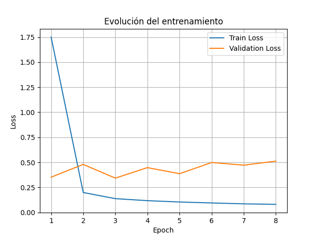
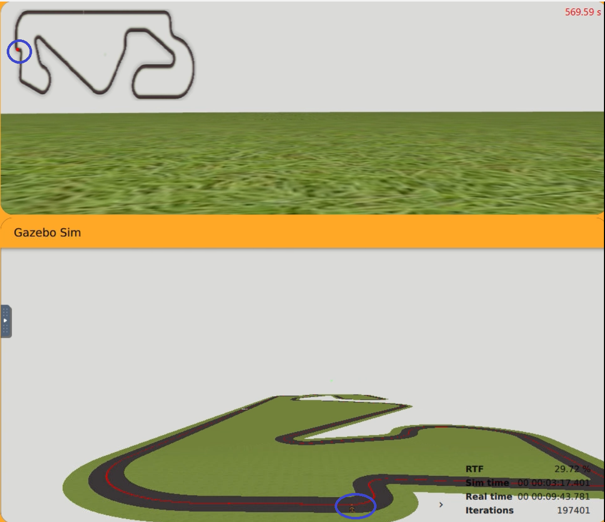

# Práctica 4 - Control visual Extremo a Extremo con DeepLearning

## Objetivo

El objetivo de esta práctica es desarrollar un sistema de control visual extremo a extremo utilizando técnicas de Deep Learning. Para ello, se entrenará una red neuronal capaz de aprender directamente, a partir de un dataset etiquetado, la relación entre la percepción visual del entorno y las acciones de control necesarias para conducir el F1 de forma autónoma. De esta manera, el sistema aprenderá tanto la percepción del entorno como la toma de decisiones de conducción.

El sistema debe ser capaz de:

- Detectar la línea.
- Predecir la velocidad lineal (v).
- Predecir la velocidad angular (w).
- Ejecutarse correctamente en distintos circuitos de Unibotics, comprobando la capacidad de generalización del modelo ante escenarios diferentes.

## Enfoque

Para abordar la solución de este problema, he dividido el sistema en las siguientes etapas:

1. Preprocesamiento de la imagen
2. Red Neuronal
3. Evaluación del modelo
4. Integración con Unibotics
5. Demo con los resultados obtenidos

### 1. Preprocesamiento de la imagen
Antes de entrenar la red neuronal, se aplicaron varias transformaciones sobre las imágenes para simplificar el problema y mejorar el aprendizaje.

A continuación, se muestra el resultado obtenido después del preprocesamiento de la imagen:


Esto me permitió observar que se podía recortar, un poco más, la imagen:


Cabe destacar que este preprocesamiento también debe aplicarse posteriormente en Unibotics durante la fase de inferencia. Esto es fundamental, ya que la red neuronal debe recibir exactamente el mismo tipo de entrada que utilizó durante el entrenamiento.

Dicho de otra manera, mediante este preprocesamiento se está definiendo la representación de entrada de la red neuronal. Si las imágenes utilizadas en inferencia fueran diferentes a las empleadas durante el entrenamiento, el rendimiento del modelo podría degradarse considerablemente.

#### 1.1 Recortar la imagen 

Como parte del preprocesamiento, se eliminó el 20% superior de cada imagen antes de introducirla en la red neuronal.

Esta decisión se tomó porque la zona superior contiene principalmente información irrelevante para la conducción, como el cielo, el horizonte o elementos lejanos del entorno, que no aportan información útil para el seguimiento de la línea.

Además, este recorte permite:

- Reducir el ruido presente en la imagen.
- Simplificar la información de entrada.
- Disminuir el coste computacional.
- Facilitar que la red neuronal se centre únicamente en la carretera y la línea de referencia.

#### 1.2. Filtro de color

El circuito utiliza una línea roja como referencia principal de navegación. Por ello, se aplicó un filtro HSV para detectar únicamente los píxeles rojos de la imagen.

Este enfoque también lo utilizamos en la [**Práctica 1: Visual Follow Line**](./práctica1/Follow_line.md) aunque este caso el resultado del filtrado se emplea para la entrada de la red neuronal.

A continuación, se enumeran las ventajas de aplicar este filtro:

- Reducción de la complejidad visual de la escena.
- Eliminación de gran parte del ruido de fondo.
- Mejora de la estabilidad del entrenamiento.
- Reducción del coste computacional.

#### 1.3 Redimensionamiento de la imagen

Las imágenes capturas por la cámara tienen una resolución de **640x480**. Sin embargo, antes de ser introducidas a la red, se redujo su tamaño a **200x66**.

Este redimensionado se realizó con el objetivo de simplificar la entrada de datos y optimizar el rendimiento del sistema.

Los beneficios obtenidos fueron:

- Reducir el tiempo de entrenamiento de la red neuronal.
- Disminuir el consumo de memoria durante el entrenamiento e inferencia.
- Reducir el coste computacional de las operaciones convolucionales.
- Mantener únicamente la información visual relevante para la conducción.

### 2. Red Neuronal

#### 2.2 Dataset
El dataset (balanceado) utilizado para el entrenamiento está compuesto por:

- La imagen capturada.
- La velocidad lineal (`v`).
- La velocidad angular (`w`).

Cada muestra del dataset relaciona directamente una imagen con las acciones de control aplicadas al vehículo en ese instante.

El formato utilizado fue un fichero CSV (`label.csv`) con la siguiente estructura:

```
image,v,w
images_part_01/image_1.png,4.0,-0.7414299999999976
```

El conjunto de datos tiene 50000 muestras. Además, este se encuentra balanceado, evitando un exceso de muestras de conducción en línea recta frente a curvas, lo cual favorece un aprendizaje más estable y una mejor capacidad de generalización.

La división de datos utilizada fue la siguiente:

| Dataset    | Porcentaje |
| ---------- | ---------- |
| Train      | 80%        |
| Validation | 10%        |
| Test       | 10%        |

En caso de que el dataset no hubiese estado balanceado, habría sido necesario aplicar técnicas adicionales para compensar dicho desequilibrio, como por ejemplo **Data Augmentation**.

#### 2.2 Arquitectura de la red neuronal

Para resolver el problema de conducción autónoma se utilizó una arquitectura basada en **PilotNet**, una red neuronal convolucional desarrollada originalmente por NVIDIA para tareas de conducción autónoma extremo a extremo.

La salida final de la red está compuesta por dos valores:

```
[v, w]
```

**Función de pérdida**

Dado que el problema consiste en predecir valores continuos, se trata de un problema de regresión. Por este motivo, se utilizó la función de pérdida:

```
nn.MSELoss()
```

La función MSE (Mean Squared Error) calcula el error cuadrático medio entre las velocidades predichas por la red y las velocidades reales del dataset.

**Optimizador**

Para el entrenamiento de la red neuronal se utilizó el optimizador Adam

Los hiperparámetros principales utilizados fueron:

- Learning Rate (`LR`): 1e-4
- Regularización L2 (`weight_decay`): 1e-4

**Early Stopping**

Con el objetivo de evitar problemas de overfitting, se implementó la técnica de Early Stopping.

El funcionamiento consiste en monitorizar la pérdida de validación durante el entrenamiento. Si dicha pérdida no mejora durante varias épocas consecutivas, el entrenamiento se detiene automáticamente.

Esto significa que si la validación no mejora durante 5 épocas consecutivas, el entrenamiento finaliza automáticamente.

De esta forma se evita continuar entrenando un modelo que ya no está generalizando correctamente.

El número de épocas definido para este problema fue de 15, con un criterio de `early stopping` establecido en 5 épocas. Más adelante se mostrará, que no fue necesario entrenar el modelo durante todas las épocas previstas.

Por tanto, únicamente se almacenará el modelo con el mejor resultado en validación:

```
torch.save(model.state_dict(), "best_model.pth")
```

Posteriormente, dicho modelo se recupera para realizar la evaluación final y la exportación.


**Exportación a ONNX**
Finalmente, el modelo entrenado se exportó al formato ONNX. Este fichero se importará en Unibotic para validar la inferencia en tiempo real en los diferentes circuitos.


### 3. Evaluación

Tras el entrenamiento de la red neuronal, se obtuvieron los siguientes resultados:

```
Epoch 1/15 | Train Loss: 1.7516 | Val Loss: 0.3515
Mejor modelo encontrado en epoch 1 con val_loss 0.3515. Guardando modelo...

Epoch 2/15 | Train Loss: 0.1987 | Val Loss: 0.4793
⏳ No mejora (val_loss=0.4793). EarlyStopping count: 1/5

Epoch 3/15 | Train Loss: 0.1372 | Val Loss: 0.3422
Mejor modelo encontrado en epoch 3 con val_loss 0.3422. Guardando modelo...

Epoch 4/15 | Train Loss: 0.1169 | Val Loss: 0.4471
⏳ No mejora (val_loss=0.4471). EarlyStopping count: 1/5

Epoch 5/15 | Train Loss: 0.1037 | Val Loss: 0.3863
⏳ No mejora (val_loss=0.3863). EarlyStopping count: 2/5

Epoch 6/15 | Train Loss: 0.0941 | Val Loss: 0.4980
⏳ No mejora (val_loss=0.4980). EarlyStopping count: 3/5

Epoch 7/15 | Train Loss: 0.0853 | Val Loss: 0.4716
⏳ No mejora (val_loss=0.4716). EarlyStopping count: 4/5

Epoch 8/15 | Train Loss: 0.0802 | Val Loss: 0.5119
⏳ No mejora (val_loss=0.5119). EarlyStopping count: 5/5

Activado Early Stopping.
```

Durante las primeras épocas, la red neuronal consigue reducir rápidamente tanto el error de entrenamiento como el error de validación, indicando que el modelo está aprendiendo correctamente las características principales del problema.

Sin embargo, a partir de las siguientes épocas puede observarse que el Train Loss continúa disminuyendo progresivamente mientras que el Validation Loss comienza a aumentar.

Este comportamiento indica overfitting, donde la red neuronal empieza a ajustarse demasiado a los datos de entrenamiento y pierde capacidad de generalización sobre datos no vistos. Por esta razón se aplicó Early Stopping, que detiene automáticamente el entrenamiento cuando la validación deja de mejorar durante varias épocas consecutivas.

La siguiente gráfica muestra la evolución de las pérdidas de entrenamiento y validación a lo largo de las distintas épocas:



En la gráfica puede observarse claramente cómo el error de entrenamiento continúa disminuyendo mientras que el error de validación comienza a empeorar ligeramente indicando que el mejor modelo conseguido fue en la época 3 de esta ejecución. En otras ocasiones se consiguió el mejor modelo en la época 1.

#### Evaluación final
Una vez finalizado el entrenamiento, se evaluó el modelo utilizando el conjunto de test, reservado exclusivamente para la evaluación final.

Consiguiendo el siguiente resultado:

```
Test Loss FINAL: 0.3484
```
Este valor indica que el modelo es capaz de generalizar sobre los datos no utilizados durante el entrenamiendo.

#### Rendimiento e inferencia
Otra medida para evaluar el sistema es el tiempo en inferencia.

Los resultado obtenidos fueron:

```
Tiempo medio de inferencia: 1.211 ms
FPS aproximados: 826.10
```

Estos resultados muestran que el sistema es suficientemente rápido para funcionar en tiempo real en Unibotics.

### 4. Integración con Unibotics

Una vez finalizado el entrenamiento, se subió el modelo ONNX a Unibotics para realizar evaluar el modelo.

Para que el sistema funcione correctamente fue fundamental aplicar el mismo preprocesamiento utilizado durante el entrenamiento de la red. En el apartado 1 se detallan las operaciones realizadas.

### 5. Demo con los resultados obtenidos
Esta práctica fue una mejora de la [**Práctica 1: Visual Follow Line**](./práctica1/Follow_line.md) utilizando redes neuronales.

Los resultados obtenidos muestran una mejora significativa en el comportamiento del F1 durante la conducción. En comparación con la práctica anterior, el sistema desarrollado presenta:

- Una conducción más suave y estable.
- Menores oscilaciones durante el seguimiento de la línea.
- Mejor adaptación en curvas.
- Mayor estabilidad en la velocidad del vehículo.
- Un comportamiento menos “nervioso” durante la conducción.

Esto demuestra que las redes neuronales permiten obtener mejores resultados, dando lugar a un sistema más robusto.

A continuación, se muestran unos **vídeos** con los resultados obtenidos.

#### Circuito Simple

[](https://youtu.be/YrJ0WrQLPDI)

#### Circuito Montmelo

[](https://youtu.be/4T4MpVCOmjg)

No obstante, también se observó un caso en el que el sistema no consigue recuperarse correctamente tras desviarse excesivamente de la línea.

Este comportamiento indica que el modelo presenta dificultades en situaciones de recuperación, probablemente debido a la falta de ejemplos similares dentro del dataset de entrenamiento. En consecuencia, la red neuronal no ha aprendido correctamente cómo actuar ante este tipo de escenarios poco frecuentes.

Este problema pone de manifiesto la importancia de disponer de un dataset suficientemente variado y representativo, incluyendo no solo casos ideales de conducción, sino también situaciones de error, desviaciones y recuperación de trayectoria.



#### Circuito Montreal

[](https://youtu.be/AJTyCFvWV80)

#### Circuito Nurburgring

[](https://youtu.be/4dl6b6zFFxI)

